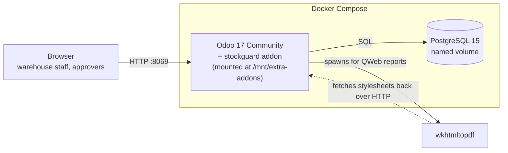
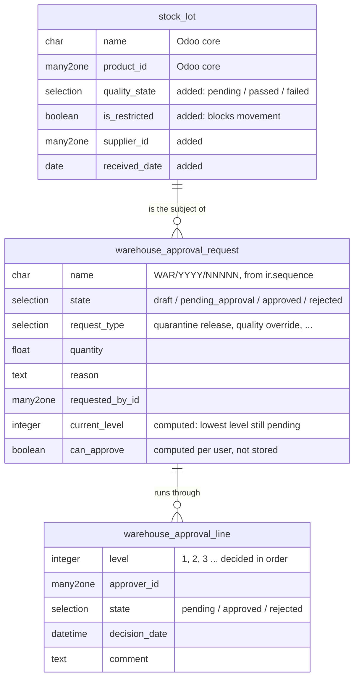
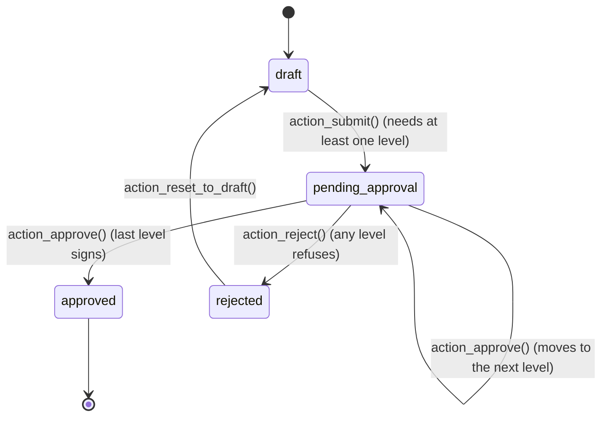

# StockGuard

**Lot control and a multi-level approval workflow for Odoo 17 Community.**

A warehouse cannot simply release stock that failed inspection. Somebody has to
ask, somebody senior has to sign, and the whole thing has to be auditable
afterwards. StockGuard adds that control layer to Odoo's own lot/serial tracking,
without replacing any of it.

Built as a custom Odoo module — Python models, XML views, QWeb reports, security
rules and a test suite — on Odoo 17 Community Edition, running on Docker.

---

## The problem it solves

A lot of medicine arrives, fails a temperature check, and is quarantined. Later
the supplier sends a second lab report saying the batch is fine. Now what?

In stock Odoo, someone with inventory rights just edits the record. There is no
request, no second signature, and no paper trail that satisfies an auditor.

StockGuard turns that into a controlled document:

- A lot can be flagged **movement restricted**, with a quality state of its own.
- Releasing it requires an **approval request** with a stated reason.
- The request runs through **numbered approval levels, one at a time** — level 2
  cannot sign before level 1 has.
- **The person who raised the request can never approve it** — enforced in the
  data layer, not just hidden in the interface.
- When the last level signs, the system **releases the lot itself**.
- Every state change lands in Odoo's chatter, and the whole document prints to
  PDF for the audit file.

---

## What it looks like

The approval board, grouped by status. Every stage stays visible even when it is
empty, so the process reads as a pipeline rather than changing shape with the
data:

| Draft | Pending Approval | Approved | Rejected |
| --- | --- | --- | --- |
| Being written up | Waiting on a named approver at a given level | Signed off, lot released | Refused, can be sent back to draft |

A printed request is in [`docs/sample-approval-request.pdf`](docs/sample-approval-request.pdf) —
two documents in one file, showing an approved request and one still pending.

---

## Architecture



That dotted line matters: the PDF renderer is a separate process that calls the
Odoo server back over HTTP to collect the report's stylesheets. If the web
server is not listening, PDF generation hangs — see
[Notes from building it](#notes-from-building-it).

---

## Data model

StockGuard **extends** Odoo's existing `stock.lot` rather than creating a
parallel model beside it. A second "custom lot" model would have been easier to
write and would have cut the data off from real stock moves, quants and
traceability. Extending keeps one lot, with more on it.



Splitting the approval levels into their own model is what makes the workflow
genuinely multi-level: a request holds as many levels as the business needs,
each with its own approver and its own decision.

---

## The approval workflow



Rules enforced in Python, each covered by a test:

| Rule | Where |
| --- | --- |
| Only a draft request can be submitted, and only with at least one level | `action_submit` |
| Levels are decided in order — no jumping the queue | `_get_decidable_line` |
| Only the named approver of the current level may decide | `_get_decidable_line` |
| One refusal rejects the whole request | `action_reject` |
| Approving the last level releases the lot | `_apply_approval_effect` |
| An approved request can never be deleted | `unlink` |
| The requester cannot appear as an approver | `@api.constrains` |
| A level number cannot be used twice on one request | SQL constraint |

---

## Security model

Two layers, which Odoo keeps deliberately separate:

- **Access rights** (`ir.model.access.csv`) answer *may this group touch this
  model at all*. Warehouse Users get read-only access to approval lines, so a
  requester physically cannot write a decision — the interface is not the thing
  stopping them.
- **A record rule** (`ir.rule`) answers *which records may they see*, scoping
  requests to the user's own company.

Three groups inherit from each other, so permissions are declared once:

```
Warehouse User  ->  Warehouse Approver  ->  Warehouse Manager
   raise                decide on              everything, including
   requests             assigned levels        deleting drafts
```

---

## Getting started

Requires Docker Desktop (or Docker Engine + Compose). Nothing else is installed
on the host.

```bash
git clone <your-repo-url> stockguard
cd stockguard
docker compose up -d          # first run pulls Odoo 17 and PostgreSQL 15
```

Create the database and install the module with its demo data:

```bash
docker compose stop odoo
docker compose run --rm odoo odoo -c /etc/odoo/odoo.conf -d stockguard_dev \
  -i stockguard --stop-after-init
docker compose up -d
```

Then open <http://localhost:8069>, log in as `admin` / `admin`, and pick
**StockGuard** from the app menu (the grid icon, top left).

The demo data ships four requests covering every state, plus two approver
accounts — `sg_qc_supervisor` and `sg_warehouse_manager` — so the approval chain
can be walked from both sides.

> On Windows Git Bash, prefix the `run` line with `MSYS_NO_PATHCONV=1` so that
> `/etc/odoo/odoo.conf` is not rewritten into a Windows path.

---

## Running the tests

49 tests, all `TransactionCase`, covering the data model, the workflow, the
views and the report.

```bash
docker compose stop odoo
docker compose run --rm odoo odoo -c /etc/odoo/odoo.conf -d stockguard_dev \
  -u stockguard --test-enable --test-tags /stockguard --stop-after-init
docker compose up -d
```

Two details worth knowing:

- The web container is stopped first. Two Odoo processes updating modules
  against one database deadlock on `ir_module_module`.
- `--test-tags /stockguard` scopes the run to this module. Without it, installing
  a dependency also runs *that* module's suite, and Odoo core tests commit their
  fixtures into the database.

---

## Project layout

```
.
├── addons/stockguard/
│   ├── __manifest__.py            module metadata, dependencies, load order
│   ├── models/
│   │   ├── stock_lot.py           extends Odoo's lot model
│   │   ├── warehouse_approval_request.py   document + state machine
│   │   └── warehouse_approval_line.py      one approval level
│   ├── views/                     tree, form, kanban, search, graph, pivot, menus
│   ├── report/                    QWeb template + report action
│   ├── security/                  groups, record rule, access rights
│   ├── data/                      document number sequence
│   ├── demo/                      sample requests in every state
│   └── tests/                     49 tests
├── config/odoo.conf               development server config
├── deploy/                        hardened compose + config for a real server
├── docs/                          sample printed output
└── docker-compose.yml             development stack
```

---

## Deploying

`deploy/` holds a hardened variant of the stack. The differences from the
development setup are the interesting part:

| Development | Production | Why |
| --- | --- | --- |
| Port `8069` on all interfaces | Bound to `127.0.0.1` | A reverse proxy terminates TLS in front of it |
| `list_db` enabled | `list_db = False` | Removes the database manager, and with it the master-password attack surface |
| `dbfilter = .*` | `dbfilter = ^stockguard$` | The server answers for exactly one database |
| Credentials in the config file | Injected from the environment | Secrets never enter git |
| Single threaded | `workers = 5`, `max_cron_threads = 2` | Multi-process, with memory and time limits |
| addons mounted read-write | Mounted read-only | The running container cannot alter its own code |
| `proxy_mode` off | `proxy_mode = True` | Odoo trusts the proxy's forwarded client address |

```bash
cd deploy
cp .env.example .env     # then edit it
docker compose -f docker-compose.prod.yml up -d
```

The compose file is validated; it has not been run against a live server.

---

## Notes from building it

Problems that cost real time, kept here because the diagnosis is the useful part.

**A module update while the web server was running corrupted the database.**
Two Odoo processes wrote `ir_module_module` at once and PostgreSQL aborted one
with `could not serialize access due to concurrent update`. The rollback was not
clean — Odoo commits between module-loading steps, so the module state reverted
while data it had already written stayed behind. The database ended up with a
stray warehouse and orphaned lots while claiming the module was uninstalled. The
fix is procedural: stop the web container before any CLI install or update.

**A computed field returned one user's answer to everybody.** `can_approve` asks
"is this request waiting on *you*". It was returning `True` for the level-2
approver while level 1 was still pending. Odoo caches non-stored computed fields
for the whole transaction and had no idea this one varied by user; the field
needed `@api.depends_context('uid')`. A single-user click-through would never
have caught it — a test that switched users did.

**A search filter on a field that does not exist in the database.** "Waiting For
Me" filters on `pending_approver_ids`, which is computed and not stored, so
there is no column to search. Odoo allows a field to declare its own `search=`
method, which translates the filter into a query over the approval lines.

**The PDF status stamp was invisible.** Bootstrap's badge is white text on a
coloured background, and wkhtmltopdf drops background fills when printing. The
text was in the file and searchable, but the page looked blank where it should
have been. Coloured text inside a coloured border prints reliably.

**Forcing real PDF rendering inside the test suite hung for ten minutes.** Odoo
deliberately falls back to HTML rendering during tests; overriding that spawns
wkhtmltopdf, which tries to fetch stylesheets over HTTP from an Odoo server that
the test recipe had just stopped. Odoo's default behaviour was right and the
test was wrong.

---

## Built with

Odoo 17 Community Edition · Python 3.10 · PostgreSQL 15 · Docker Compose ·
XML views · QWeb reports · wkhtmltopdf

## Licence

LGPL-3, the licence Odoo Community modules are normally published under. See
[LICENSE](LICENSE).
